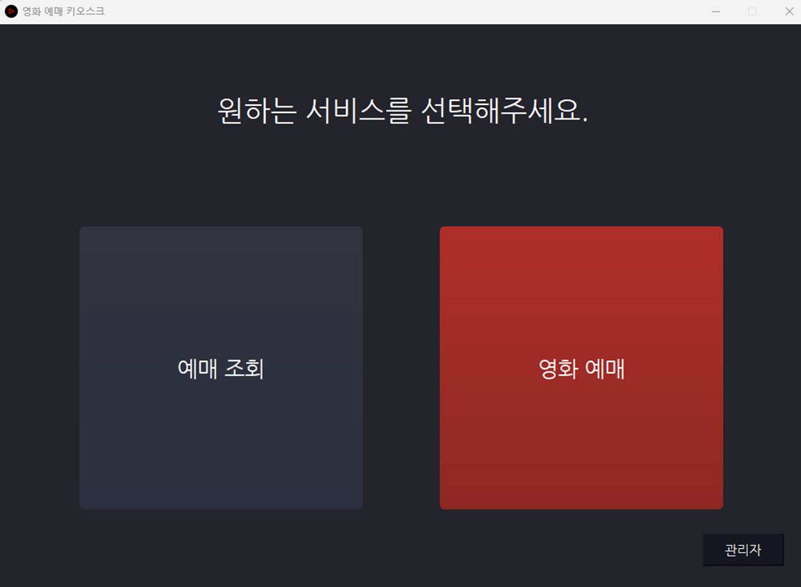
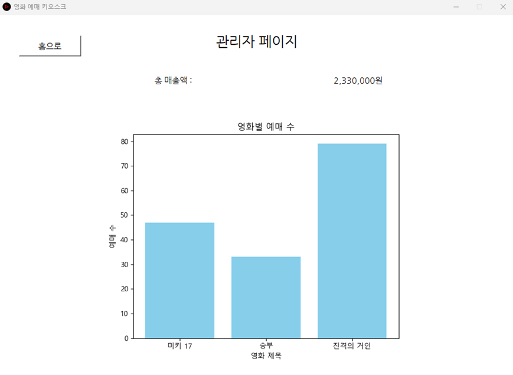
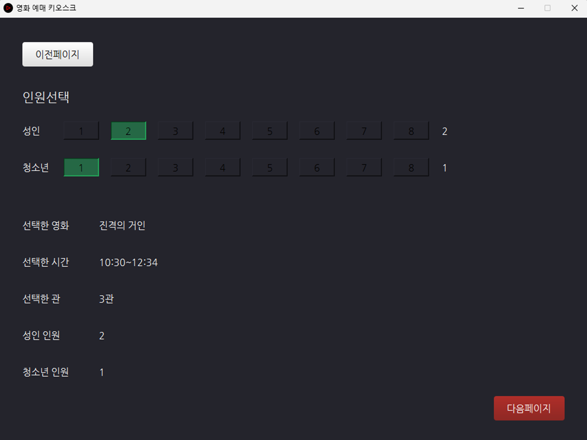
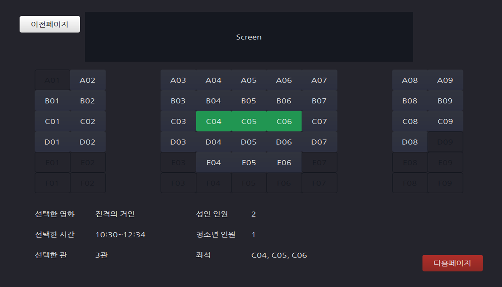
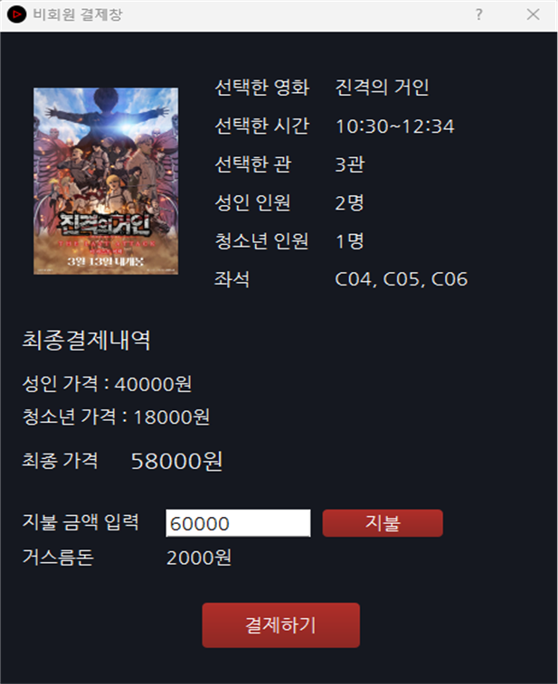

# 미니프로젝트

---

# 🎬 영화 예매 키오스크

> 4조 프로젝트 – 영화 예매를 위한 통합 키오스크 시스템

PyQt5 기반 GUI 프로그램으로 영화 예매, 좌석 선택, 결제, 예매 조회, 관리자 통계 기능까지 포함된 **오프라인 키오스크형 예매 시스템**입니다.

---

## 📌 프로젝트 개요

- **프로젝트명**: 영화 예매 키오스크 시스템
- **개발 기간**: 5일
- **개발 환경**: Windows, Python 3.x, Oracle DB
- **사용 기술**:
  - PyQt5 (GUI)
  - cx_Oracle (DB 연동)
  - matplotlib (예매 통계 시각화)
  - SQL (데이터 저장 및 조회)

---

## 🧑‍💻 팀원 및 역할

| 이름   | 역할                       |
| ------ | -------------------------- |
| 김기윤 | DB 설계, 기능 구현         |
| 이성훈 | DB 설계, 기능 구현         |
| 이지민 | UI 구현, 기능 구현         |
| 정희성 | UI/CSS 디자인 및 기능 구현 |

---

## 🗂️ 기능 구성

### 사용자

- 영화 목록 확인 및 시간/관 선택
- 인원 선택 및 좌석 선택
- 회원 / 비회원 확인 및 결제 진행
- 예매 완료 후 예매번호 확인
- 예매 조회 기능 (예매번호 기반 조회)

### 관리자

- 관리자 로그인
- 총 매출 조회
- 영화별 예매 건수 통계 그래프

---

## 🛠 주요 기술 스택

| 범주          | 사용 기술                                                        |
| ------------- | ---------------------------------------------------------------- |
| 프론트엔드    | PyQt5 (QStackedWidget, QDialog, QPushButton 등), CSS             |
| 백엔드        | Python (데이터 처리), Oracle SQL                                 |
| 데이터 시각화 | matplotlib                                                       |
| DB 연동       | cx_Oracle                                                        |
| 기타          | UI 디자인 (.ui 파일 기반), 사용자 상태 전역 관리 (`GlobalStore`) |

---

## 🧾 DB 설계

- **ERD 구성**: 영화, 상영관, 좌석, 유저, 예매정보, 결제정보 등 총 10개 이상의 테이블로 구성
- **예매/결제 흐름**: 회원 or 비회원 → 영화/시간 선택 → 인원 선택 → 좌석 선택 → 결제 및 티켓 생성 → DB 저장

---

## 📸 주요 화면

| 메인 화면               | 관리자 페이지             |
| ----------------------- | ------------------------- |
|  |  |

| 예매 과정                                                                          |
| ---------------------------------------------------------------------------------- |
|  →  →  |

| 결제창                 |
| ---------------------- |
|  |

---

## 🔄 추진 일정

| 일차  | 내용                         |
| ----- | ---------------------------- |
| 1일차 | 주제 선정, UI 기획, ERD 설계 |
| 2일차 | UI 구현, DB CRUD 기능 개발   |
| 3일차 | 페이지별 주요 기능 개발      |
| 4일차 | UI 개선 및 오류 수정         |
| 5일차 | 통합 테스트 및 최종 마무리   |

---

## 🚀 실행 방법

1. Oracle DB 환경 구성 및 테이블/데이터 사전 삽입
2. `.ui` 파일과 `icon.png` 포함된 동일 디렉토리에 `index.py` 위치
3. 다음 명령어로 실행

```bash
python index.py
```
